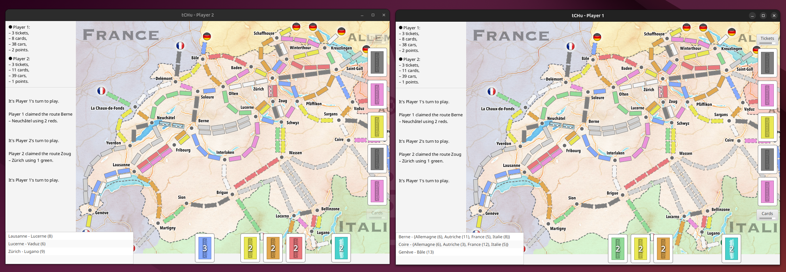
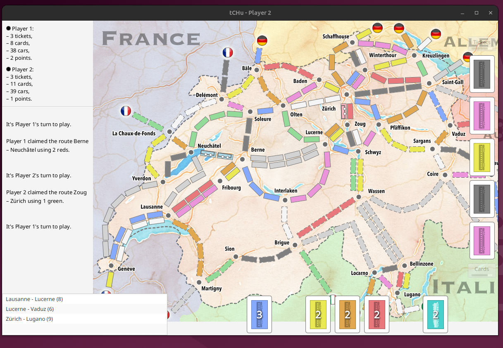

# tCHu - Scala Edition

A Scala 3 implementation of tCHu, a train game inspired by Ticket to Ride, originally developed as a Java CS-108 project at EPFL.

## Screenshots


*Local mode with two player windows side by side*


*Single player view showing the Swiss railway map*

## Requirements

- Java 21+
- sbt 1.10+
- JavaFX 21 (automatically downloaded via sbt)

## Running the Game

### Local Mode (Two Players, Same Machine)

The easiest way to play - both players on the same computer with two windows:

```bash
sbt "run local"
```

### Network Mode

**Server (Host):**
```bash
sbt run
```

**Client (Join):**
```bash
sbt "run <server-ip>"
# or with custom port:
sbt "run <server-ip> <port>"
```

**Quick Network Launch (Linux):**
```bash
./launch-network.sh
```

## Building an Executable JAR

Create a standalone JAR file:

```bash
sbt assembly
```

This creates `target/scala-3.8.0/tchu.jar`. Run it with:

```bash
# Local mode
java -jar target/scala-3.8.0/tchu.jar local

# Server mode
java -jar target/scala-3.8.0/tchu.jar

# Client mode
java -jar target/scala-3.8.0/tchu.jar <server-ip>
```

## Running Tests

```bash
sbt test
```

## Project Structure

```
src/
  main/
    scala/ch/epfl/tchu/
      game/       # Game logic (Route, Ticket, Card, GameState, etc.)
      gui/        # JavaFX GUI (GraphicalPlayer, MapView, DecksView, etc.)
      net/        # Networking (Serde, RemotePlayerProxy, etc.)
    resources/    # Images, CSS, FXML files
  test/
    scala/        # Unit tests
```

## Features

- Full game implementation with all rules
- Graphical interface with Swiss railway map
- Network play support (server/client)
- Local play mode (two windows)
- Bilingual support (English/French)
- 115 unit tests

## Language

Select your preferred language (English or French) when the game starts. Each player can choose their own language.

## License

This project is for educational purposes. Based on the CS-108 course at EPFL.
